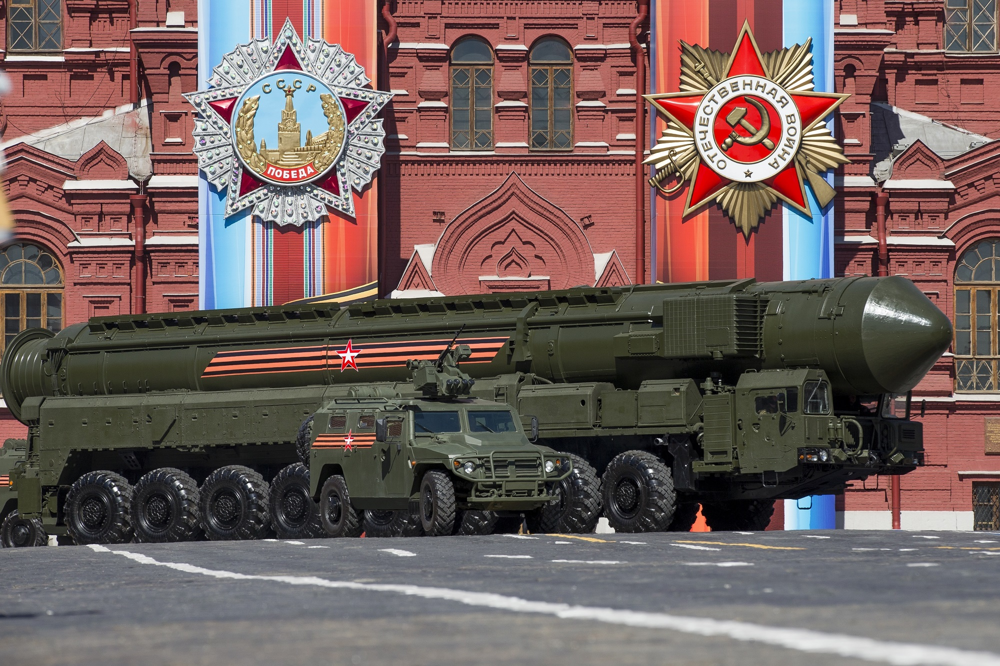
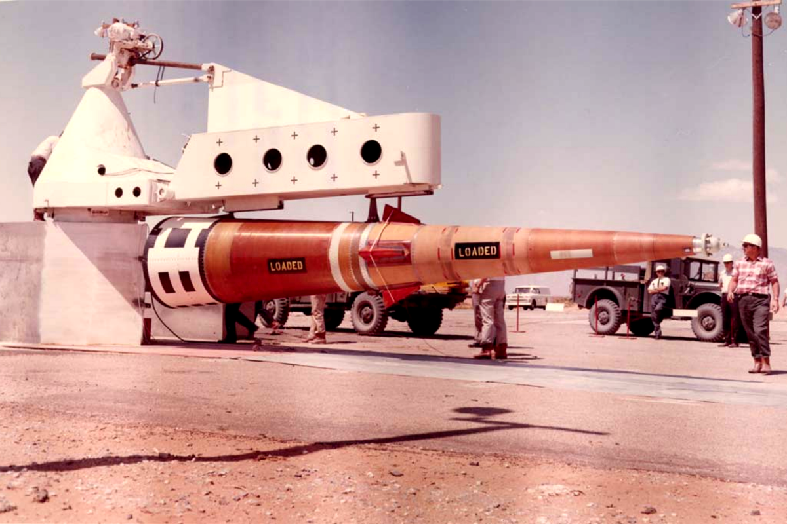

<h1 align=center>
  Missile Guidance: Project 1
</h1>
<h2 align=center>
  Mission: Sprint ABM Interception
</h2>

## Mission Overview

This project simulates a Cold War–era ballistic missile defense scenario. In this mission, a hostile intercontinental ballistic missile launched from the **Soviet Union** is detected traveling toward the **United States**.

  

To defend against the incoming threat, the U.S. deploys the **Sprint anti-ballistic missile (ABM)** interceptor.

  

The objective of the simulation is to model the interception dynamics between the incoming ballistic missile and the defensive interceptor. The Sprint missile must rapidly launch, accelerate to hypersonic speed, and reach the predicted intercept point before the hostile warhead reaches its target.

This simulation focuses on the physical dynamics of missile flight, including:

* Detection and tracking of the incoming ballistic missile
* Launch and rapid acceleration of the interceptor
* Guidance toward the predicted interception point
* Terminal interception event

The scenario reflects concepts from the Cold War missile defense systems developed under the **Safeguard Program**, designed to protect strategic assets from incoming nuclear threats.

---

## Defensive System: Sprint Anti-Ballistic Missile

The interceptor modeled in this simulation is the **Sprint (missile)**, an extremely high-acceleration missile designed to intercept incoming warheads at short range.

Sprint missiles were developed in the 1960s as part of U.S. missile defense systems intended to intercept nuclear warheads during the terminal phase of their trajectory.

### Key Characteristics

* **Role:** Terminal-phase anti-ballistic missile interceptor
* **Country of origin:** United States
* **Program:** Safeguard Program

### Physical Specifications

| Parameter     | Value                 |
| ------------- | --------------------- |
| Length        | ~8.2 meters           |
| Diameter      | ~1.35 meters          |
| Launch mass   | ~3,500 kg             |
| Stages        | 2-stage solid rocket  |
| Maximum speed | Mach 10+ (≈ 3–4 km/s) |
| Acceleration  | up to ~100 g          |

Sprint missiles were designed to accelerate extremely quickly immediately after launch in order to reach intercept altitude within seconds.

---

## Warhead

The Sprint interceptor carried a **W66 nuclear warhead**.

| Parameter | Value                                                     |
| --------- | --------------------------------------------------------- |
| Type      | Enhanced radiation nuclear warhead                        |
| Yield     | ~5 kilotons TNT equivalent                                |
| Purpose   | Destroy incoming warheads via intense radiation and blast |

Rather than requiring a direct hit, the nuclear warhead would disable or destroy the incoming reentry vehicle within a certain radius of the detonation point.

---

## Target Threat

The incoming target in this simulation represents a ballistic missile launched from the **Soviet Union** during a hypothetical strategic attack scenario.

Ballistic missiles follow a three-phase trajectory:

1. **Boost phase** – rocket engines propel the missile into space
2. **Midcourse phase** – the warhead travels through space along a ballistic trajectory
3. **Terminal phase** – the warhead reenters the atmosphere toward its target

The Sprint interceptor is designed specifically to operate during the **terminal phase**, where reaction time is extremely limited.

---

## Simulation Goals

The goal of this project is to model and visualize the dynamics of missile interception, including:

* Ballistic trajectory modeling
* Hypersonic interceptor acceleration
* Interception geometry
* Guidance and pursuit behavior
* 3DOF and later 6DOF flight dynamics

This simulation provides a computational framework for studying missile defense dynamics and high-speed intercept scenarios.

---

## Project Scope

This repository will evolve through multiple simulation stages:

* **3DOF dynamics** — simplified translational motion
* **6DOF dynamics** — full rigid-body flight dynamics
* **Guidance algorithms** — pursuit and intercept logic
* **Trajectory visualization** — 3D simulation of intercept events

The final objective is to create a physics-based simulation of missile interception scenarios inspired by historical missile defense systems.

